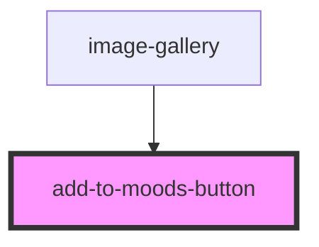

# add-to-moods-button

<!-- Auto Generated Below -->

## Properties

| Property          | Attribute          | Description | Type                | Default   |
| ----------------- | ------------------ | ----------- | ------------------- | --------- |
| `contentLocation` | `content-location` |             | `"left" \| "right"` | `'left'`  |
| `disabled`        | `disabled`         |             | `boolean`           | `false`   |
| `imageUrl`        | `image-url`        |             | `string`            | `''`      |
| `postId`          | `post-id`          |             | `number`            | `null`    |
| `showOnHover`     | `show-on-hover`    |             | `boolean`           | `false`   |
| `theme`           | `theme`            |             | `"dark" \| "light"` | `'light'` |

## Events

| Event            | Description | Type                           |
| ---------------- | ----------- | ------------------------------ |
| `openMoodsModal` |             | `CustomEvent<MoodsModalEvent>` |

## Dependencies

### Used by

 - [image-gallery](../image-gallery)

### Graph

----------------------------------------------

*Built with [StencilJS](https://stenciljs.com/)*
