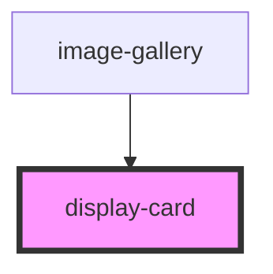

# display-card

<!-- Auto Generated Below -->

## Properties

| Property             | Attribute              | Description | Type                     | Default    |
| -------------------- | ---------------------- | ----------- | ------------------------ | ---------- |
| `bottomSubtitleName` | `bottom-subtitle-name` |             | `string`                 | `''`       |
| `bottomTitleName`    | `bottom-title-name`    |             | `string`                 | `''`       |
| `cardType`           | `card-type`            |             | `"featured" \| "normal"` | `'normal'` |
| `images`             | `images`               |             | `string`                 | `''`       |
| `linkTo`             | `link-to`              |             | `string`                 | `'#'`      |
| `theme`              | `theme`                |             | `"dark" \| "light"`      | `'light'`  |

## Dependencies

### Used by

 - [image-gallery](../image-gallery)

### Graph

----------------------------------------------

*Built with [StencilJS](https://stenciljs.com/)*
