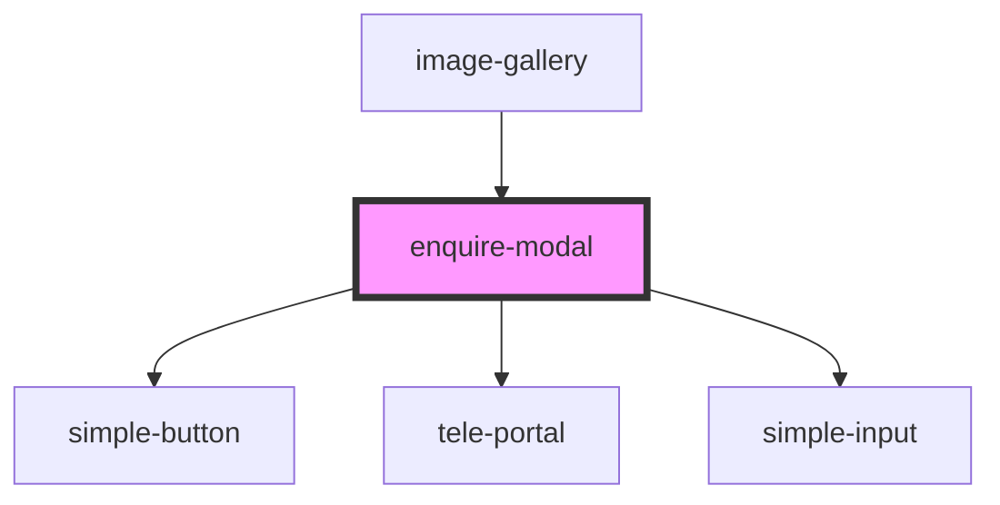

# enquire-modal

<!-- Auto Generated Below -->

## Properties

| Property       | Attribute       | Description | Type     | Default     |
| -------------- | --------------- | ----------- | -------- | ----------- |
| `postTitle`    | `post-title`    |             | `string` | `undefined` |
| `postUrl`      | `post-url`      |             | `string` | `undefined` |
| `previewImage` | `preview-image` |             | `string` | `undefined` |

## Dependencies

### Used by

 - [image-gallery](../image-gallery)

### Depends on

- [simple-button](../simple-button)
- [tele-portal](../tele-portal)
- [simple-input](../simple-input)

### Graph

----------------------------------------------

*Built with [StencilJS](https://stenciljs.com/)*
