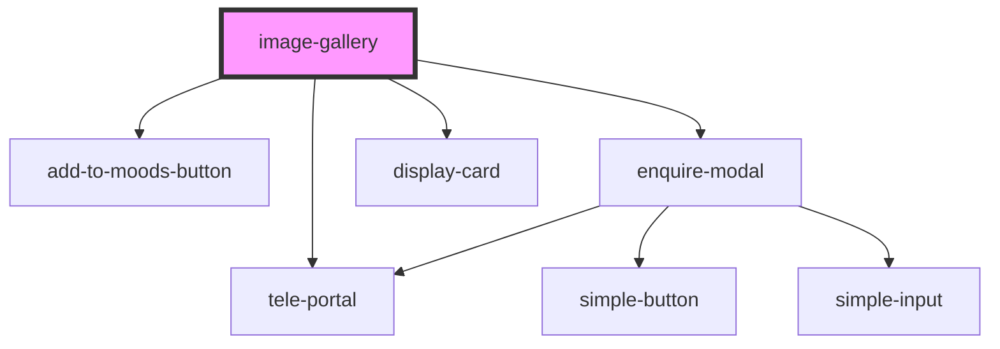

# image-gallery

<!-- Auto Generated Below -->

## Properties

| Property       | Attribute       | Description | Type      | Default     |
| -------------- | --------------- | ----------- | --------- | ----------- |
| `canEnquire`   | `can-enquire`   |             | `boolean` | `false`     |
| `designDetail` | `design-detail` |             | `string`  | `null`      |
| `images`       | `images`        |             | `string`  | `'[]'`      |
| `photographer` | `photographer`  |             | `string`  | `undefined` |
| `postExcerpt`  | `post-excerpt`  |             | `string`  | `undefined` |
| `postId`       | `post-id`       |             | `number`  | `undefined` |
| `postTitle`    | `post-title`    |             | `string`  | `undefined` |
| `previewImage` | `preview-image` |             | `string`  | `undefined` |

## Dependencies

### Depends on

- [tele-portal](../tele-portal)
- [add-to-moods-button](../add-to-moods-button)
- [enquire-modal](../enquire-modal)
- [display-card](../display-card)

### Graph

----------------------------------------------

*Built with [StencilJS](https://stenciljs.com/)*
