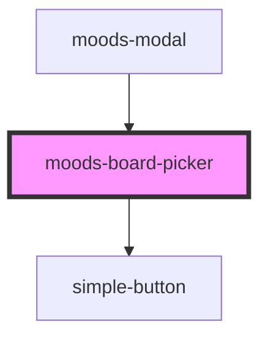

# moods-board-picker

<!-- Auto Generated Below -->

## Properties

| Property            | Attribute | Description | Type        | Default     |
| ------------------- | --------- | ----------- | ----------- | ----------- |
| `boards`            | `boards`  |             | `string`    | `''`        |
| `selectedMoodBoard` | --        |             | `MoodBoard` | `undefined` |

## Events

| Event              | Description | Type                                 |
| ------------------ | ----------- | ------------------------------------ |
| `moodsBoardPicked` |             | `CustomEvent<MoodsBoardPickedEvent>` |

## Dependencies

### Used by

 - [moods-modal](../moods-modal)

### Depends on

- [simple-button](../simple-button)

### Graph

----------------------------------------------

*Built with [StencilJS](https://stenciljs.com/)*
