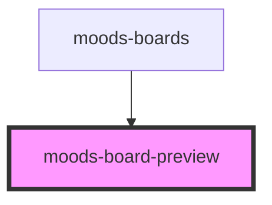

# moods-board-preview

<!-- Auto Generated Below -->

## Properties

| Property | Attribute | Description | Type         | Default     |
| -------- | --------- | ----------- | ------------ | ----------- |
| `board`  | --        |             | `MoodsBoard` | `undefined` |

## Dependencies

### Used by

 - [moods-boards](../moods-boards)

### Graph

----------------------------------------------

*Built with [StencilJS](https://stenciljs.com/)*
