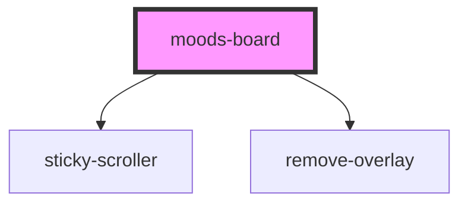

# moods-board

<!-- Auto Generated Below -->

## Properties

| Property  | Attribute  | Description | Type     | Default     |
| --------- | ---------- | ----------- | -------- | ----------- |
| `boardId` | `board-id` |             | `string` | `''`        |
| `images`  | `images`   |             | `string` | `undefined` |
| `wpNonce` | `wp-nonce` |             | `string` | `null`      |

## Events

| Event              | Description | Type                           |
| ------------------ | ----------- | ------------------------------ |
| `openMoodsGallery` |             | `CustomEvent<MoodsBoardImage>` |

## Dependencies

### Depends on

- [sticky-scroller](../sticky-scroller)
- [remove-overlay](../remove-overlay)

### Graph

----------------------------------------------

*Built with [StencilJS](https://stenciljs.com/)*
