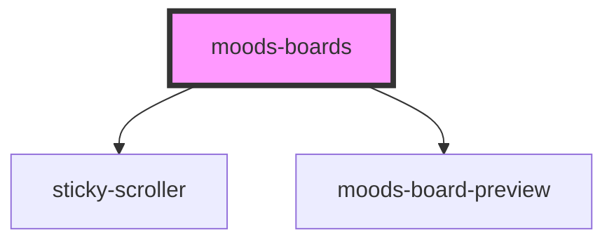

# moods-boards

<!-- Auto Generated Below -->

## Properties

| Property  | Attribute  | Description | Type     | Default                      |
| --------- | ---------- | ----------- | -------- | ---------------------------- |
| `apiUrl`  | `api-url`  |             | `string` | `'/wp-json/moods/v1/create'` |
| `boards`  | `boards`   |             | `string` | `undefined`                  |
| `wpNonce` | `wp-nonce` |             | `string` | `undefined`                  |

## Dependencies

### Depends on

- [sticky-scroller](../sticky-scroller)
- [moods-board-preview](../moods-board-preview)

### Graph

----------------------------------------------

*Built with [StencilJS](https://stenciljs.com/)*
