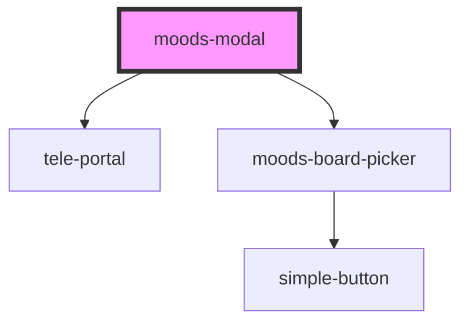

# moods-modal

<!-- Auto Generated Below -->

## Properties

| Property          | Attribute          | Description | Type      | Default |
| ----------------- | ------------------ | ----------- | --------- | ------- |
| `boards`          | `boards`           |             | `string`  | `''`    |
| `isAuthenticated` | `is-authenticated` |             | `boolean` | `false` |
| `moodsApiUrl`     | `moods-api-url`    |             | `string`  | `''`    |
| `wpApiNonce`      | `wp-api-nonce`     |             | `string`  | `''`    |

## Dependencies

### Depends on

- [tele-portal](../tele-portal)
- [moods-board-picker](../moods-board-picker)

### Graph

----------------------------------------------

*Built with [StencilJS](https://stenciljs.com/)*
