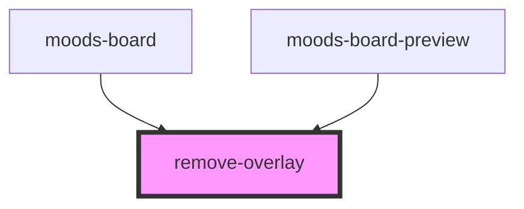

# remove-overlay

<!-- Auto Generated Below -->

## Properties

| Property  | Attribute | Description | Type     | Default |
| --------- | --------- | ----------- | -------- | ------- |
| `name`    | `name`    |             | `string` | `''`    |
| `payload` | `payload` |             | `any`    | `null`  |

## Events

| Event                | Description | Type                              |
| -------------------- | ----------- | --------------------------------- |
| `removeOverlayEvent` |             | `CustomEvent<RemoveOverlayEvent>` |

## Dependencies

### Used by

 - [moods-board](../moods-board)
 - [moods-board-preview](../moods-board-preview)

### Graph

----------------------------------------------

*Built with [StencilJS](https://stenciljs.com/)*
