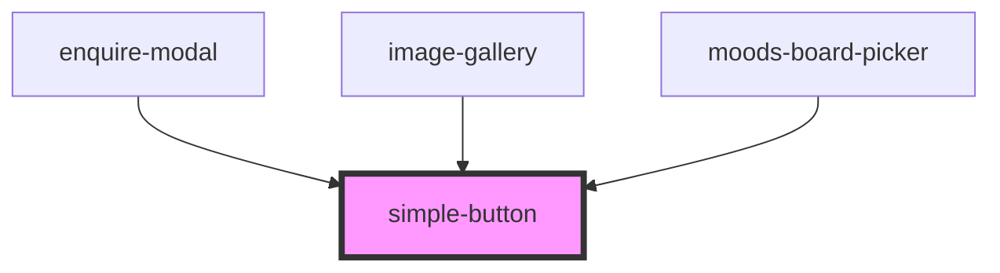

# simple-button

<!-- Auto Generated Below -->

## Properties

| Property    | Attribute    | Description | Type                | Default   |
| ----------- | ------------ | ----------- | ------------------- | --------- |
| `disabled`  | `disabled`   |             | `boolean`           | `false`   |
| `fillWidth` | `fill-width` |             | `boolean`           | `false`   |
| `theme`     | `theme`      |             | `"dark" \| "light"` | `'light'` |

## Dependencies

### Used by

 - [enquire-modal](../enquire-modal)
 - [image-gallery](../image-gallery)
 - [moods-board-picker](../moods-board-picker)

### Graph

----------------------------------------------

*Built with [StencilJS](https://stenciljs.com/)*
