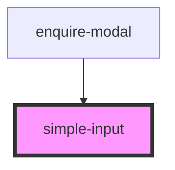

# simple-input

<!-- Auto Generated Below -->

## Properties

| Property      | Attribute     | Description | Type                                                            | Default          |
| ------------- | ------------- | ----------- | --------------------------------------------------------------- | ---------------- |
| `name`        | `name`        |             | `string`                                                        | `undefined`      |
| `placeholder` | `placeholder` |             | `string`                                                        | `'Text here...'` |
| `required`    | `required`    |             | `boolean`                                                       | `false`          |
| `type`        | `type`        |             | `"email" \| "number" \| "password" \| "tel" \| "text" \| "url"` | `undefined`      |
| `value`       | `value`       |             | `string`                                                        | `undefined`      |

## Events

| Event          | Description | Type                  |
| -------------- | ----------- | --------------------- |
| `valueChanged` |             | `CustomEvent<string>` |

## Dependencies

### Used by

 - [enquire-modal](../enquire-modal)

### Graph

----------------------------------------------

*Built with [StencilJS](https://stenciljs.com/)*
