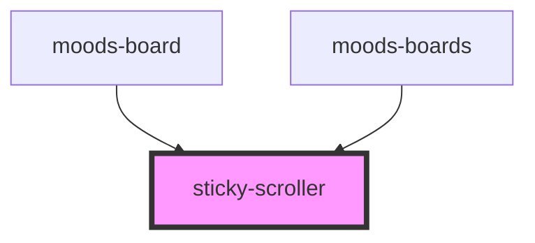

# sticky-scroller

<!-- Auto Generated Below -->

## Properties

| Property      | Attribute      | Description | Type      | Default |
| ------------- | -------------- | ----------- | --------- | ------- |
| `bottom`      | `bottom`       |             | `boolean` | `false` |
| `endOffset`   | `end-offset`   |             | `number`  | `0`     |
| `startOffset` | `start-offset` |             | `number`  | `0`     |

## Dependencies

### Used by

 - [moods-board](../moods-board)
 - [moods-boards](../moods-boards)

### Graph

----------------------------------------------

*Built with [StencilJS](https://stenciljs.com/)*
